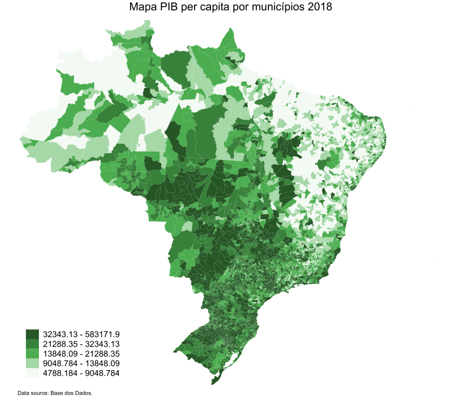

# Stata Package

__Table of Contents__  
1. [Introdução](#1-introdução)
2. [Instalação](#2-instalação)
3. [Sintaxe](#3-sintaxe)
4. [Exemplos](#4-exemplos)

# 1. Introdução

O pacote basedosdados no Stata possibilita o acesso a mais de 70 bancos de dados brasileiros já limpos e compatibilizados, disponíveis no datalake público BD+ da Base dos Dados. O pacote consiste em 7 comandos. Os comandos dão desde a possibilidade de listar todos os conjuntos de dados disponíveis do BD+ datalake até baixá-los ou analisá-los diretamente do Stata. Importante ressaltar que essa versão inicial pacote ainda é um wrapper do pacote do Python, e, portanto, necessita da execução de alguns passos antes da utilização. 


# 2. Instalação e requerimentos

A instalação do pacote `basedosdados` no Stata consiste basicamente na execução desses 2 passos: 
1. Garantir que seu Stata seja a versão 16+
2. Garantir que o Python esteja instalado no seu computador - você pode se guiar pelo nosso Mini Tutorial de Python aqui https://github.com/basedosdados/mais/issues/1159). Nesse tutorial você também vai descobrir como autenticar seu projeto pelo prompt do seu computador (muito importante!).

Obs: Caso esteja utilizando os dados da BD pela primeira vez, é necessário criar um projeto para que você possa fazer as queries no nosso repositório. Ter um projeto é de graça e basta ter uma conta Google (seu gmail por exemplo). [Veja aqui como criar um projeto no Google Cloud (https://basedosdados.github.io/mais/access_data_local/#criando-um-projeto-no-google-cloud).

Após garantir esses dois requerimentos, você pode finalmente instalar o pacote digitando o seguinte comando no seu Stata: 

```
net install github, from("https://haghish.github.io/github/")
github install basedosdados/stata-package

```

# 3. Sintaxe

Se é a sua primeira vez utilizando o pacote, digite ```db basedosdados``` e confirme novamente se as etapas acima foram concluídas com sucesso. 

O pacote contém 7 comandos, conforme suas funcionalidades descritas abaixo: 

| Comando                   | Descrição                                                                    |
|---------------------------|------------------------------------------------------------------------------|
| `bd_download`             | baixa dados da Base dos Dados (BD+).                                         |
| `bd_read_sql`             | baixa tabelas da BD+ usando consultas específicas.                           |
| `bd_read_table`           | baixa tabelas da BD+ usando dataset_id e table_id.                           |
| `bd_list_datasets`        | lista o dataset_id dos conjuntos de dados disponíveis em query_project_id.   |
| `bd_list_dataset_tables`  | lista table_id para tabelas disponíveis no dataset_id especificado.          |
| `bd_get_table_description`| mostra a descrição completa da tabela BD+.                                   |
| `bd_get_table_columns`    | mostra os nomes, tipos e descrições das colunas na tabela especificada.      |

Cada comando tem um help file de apoio, bastando abrir o help e seguir as instruções:

```
help [comando]
```

# 4. Exemplos

<p align="center">
  <a href="https://basedosdados.org">
    
  </a>
</p>

